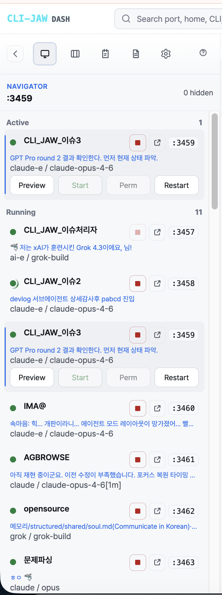
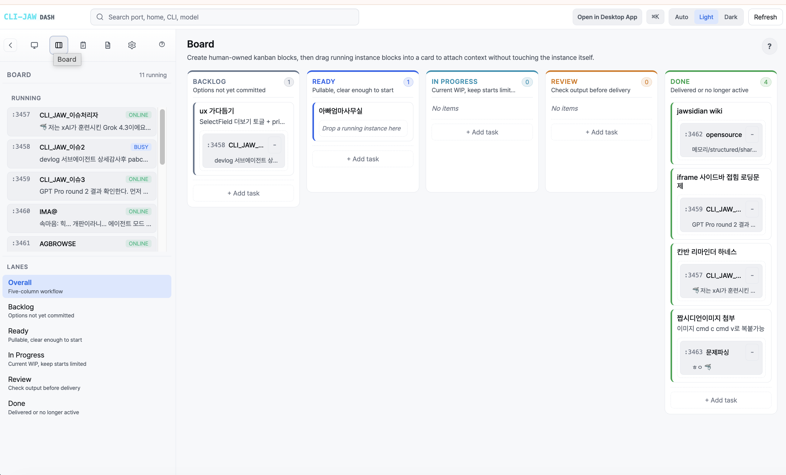
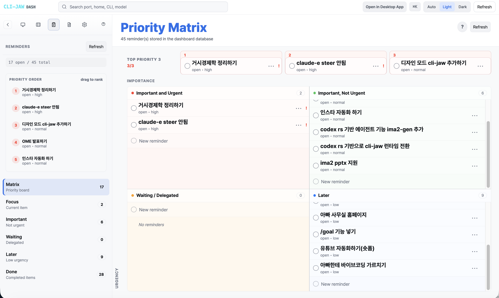
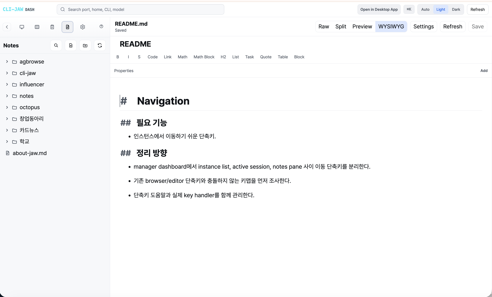
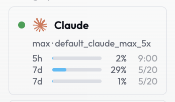

<div align="center">

# CLI-JAW

### 나만의 AI 에이전트. 2줄이면 설치 끝. 7개 AI 엔진을 하나의 대시보드에서.

[](https://npmjs.com/package/cli-jaw)
[](https://github.com/lidge-jun/cli-jaw/releases)
[](https://typescriptlang.org)
[](https://nodejs.org)
[](LICENSE)
[](#-docker)

[English](README.md) / **한국어** / [中文](README.zh-CN.md) / [日本語](README.ja.md)

</div>

## 설치

<details>
<summary><b>안전 설치</b> — 기존 사용자용, 최소 변경</summary>

```bash
# macOS / Linux
JAW_SAFE=1 npm install -g cli-jaw    # skips optional tool/runtime setup
jaw init                              # 준비되면 대화형 설정

# Windows PowerShell
$env:JAW_SAFE="1"; npm install -g cli-jaw
jaw init
```

</details>

```bash
npm install -g cli-jaw
jaw dashboard
```

끝입니다. **http://localhost:3457** 을 열면 나만의 AI 에이전트가 준비됩니다. [Node.js 22+](https://nodejs.org) 필요.

> **처음이세요?** 설치 시 Claude, Codex, Gemini, Copilot, OpenCode CLI가 자동으로 설정됩니다. 하나만 인증하면 바로 시작할 수 있습니다 ([인증](#인증) 참조).

<details>
<summary><b>macOS 원클릭</b> — Node.js가 없다면 이걸로</summary>

```bash
curl -fsSL https://raw.githubusercontent.com/lidge-jun/cli-jaw/master/scripts/install.sh | bash
```

</details>

<details>
<summary><b>Windows (WSL — Windows Subsystem for Linux)</b> — 처음부터 원클릭</summary>

```powershell
# 1. WSL 설치 (관리자 권한 PowerShell)
wsl --install
```

재시작 후 **Ubuntu**를 열고:

```bash
# 2. CLI-JAW + 전체 의존성 설치
curl -fsSL https://raw.githubusercontent.com/lidge-jun/cli-jaw/master/scripts/install-wsl.sh | bash
source ~/.bashrc
jaw dashboard
```

</details>

<details>
<summary><b>Docker</b></summary>

```bash
docker compose up -d       # → http://localhost:3457
```

</details>

---

## CLI-JAW가 뭔가요?

CLI-JAW는 여러분이 이미 사용하는 AI 코딩 CLI — Claude, Codex, Gemini, Grok, OpenCode, Copilot — 를 **하나의 비서, 하나의 메모리, 하나의 대시보드**로 통합하는 오픈소스 플랫폼입니다.

메인 CLI(Boss)가 다른 CLI를 "직원"으로 부릅니다. 앱을 왔다 갔다 할 필요 없이 한 곳에서 지시하면 됩니다.

- **API 키 불필요** — 이미 결제 중인 구독으로 라우팅
- **토큰당 과금 없음** — 기존 월정액 그대로
- **로컬 실행** — 코드가 외부로 나가지 않음

<div align="center">


</div>

---

## 인증

하나만 있으면 됩니다. 이미 결제 중인 서비스를 골라서 인증하세요:

```bash
# 무료 (신용카드 불필요)
copilot login        # GitHub Copilot (무료 티어 있음)
opencode             # OpenCode — 무료 모델 사용 가능

# 유료 (이미 결제 중인 월 구독)
claude auth login    # Anthropic Claude Max
codex login          # OpenAI ChatGPT Pro
gemini               # Google Gemini Advanced
grok login --oauth   # xAI Grok / Grok Heavy
```

한꺼번에 확인: `jaw doctor`

<details>
<summary>jaw doctor 출력 예시</summary>

```
🦈 CLI-JAW Doctor — 12 checks

 ✅ Node.js        v22.15.0
 ✅ Claude CLI      installed
 ✅ Codex CLI       installed
 ⚠️ Gemini CLI      not found (optional)
 ✅ OpenCode CLI    installed
 ✅ Copilot CLI     installed
 ✅ Database        jaw.db OK
 ✅ Skills          32 active, 194 reference
 ✅ MCP (플러그인)   3 servers configured
 ✅ Memory          structured/ exists
 ✅ Server          port 3457 available
```

</details>

---

## 대시보드

대시보드는 `http://localhost:3457`에서 동작하는 로컬 웹앱 형태의 제어판입니다.

### 인스턴스 매니저

실행 중인 AI 인스턴스를 한 눈에 볼 수 있습니다. 시작, 정지, 재시작을 클릭 한 번으로 처리하고, Web UI를 대시보드 안에서 바로 프리뷰합니다.

<div align="center">



</div>

### 칸반 보드

인스턴스 카드를 레인(Backlog → Ready → In Progress → Review → Done)에 드래그해서 배치합니다. 각 AI 세션이 무슨 작업을 하는지 추적할 수 있습니다.

<div align="center">



</div>

### 우선순위 매트릭스

할 일과 리마인더를 아이젠하워 매트릭스로 정리합니다. 중요한 것부터 처리하세요.

<div align="center">



</div>

### 노트

대시보드 안의 미니 옵시디언입니다. 폴더, 비주얼(WYSIWYG) + 원본 + 분할 편집, KaTeX(수식 렌더링), Mermaid(다이어그램), 구문 강조 코드 블록을 지원합니다.

<div align="center">



</div>

### 에이전트 상태

각 AI 엔진의 상태와 사용량을 한 눈에 모니터링합니다.

<div align="center">



</div>

---

## 직원(Employee) 시스템

핵심 아이디어: **메인 CLI가 다른 CLI를 워커로 부립니다.**

하나의 AI(Boss)에게 말하면, 전문 작업이 필요할 때 직원들에게 태스크를 배분합니다 — 각 직원은 자체 CLI와 자체 모델로 동작합니다:

```
나: "프론트엔드 스타일 고치고, API 엔드포인트도 업데이트해"

Boss (Claude) 판단 중...
  ├── Frontend 직원 (OpenCode)에게 디스패치 → "dashboard.tsx의 CSS 그리드 레이아웃 수정"
  ├── Backend 직원 (Codex)에게 디스패치     → "/api/users에서 페이지네이션 메타데이터 반환하도록 수정"
  └── 양쪽 결과를 종합해서 보고
```

```bash
# 내부적으로는 이 명령어 하나:
jaw dispatch --agent "Frontend" --task "dashboard.tsx의 CSS 그리드 레이아웃 수정"
```

직원은 설정에 등록된 다른 AI CLI입니다. 각각 자체 세션, 자체 모델, 자체 컨텍스트를 가집니다. Boss가 결과를 검토한 뒤 최종 보고합니다.

### 직원 vs 서브에이전트

이 둘은 다른 것입니다:

| | 직원 | 서브에이전트 |
|---|---|---|
| **뭔가요** | 다른 AI CLI (Codex, OpenCode 등)를 워커로 설정한 것 | 단일 CLI 안의 병렬 태스크 도구 |
| **언제 쓰나요** | 여러 전문가가 서로 다른 코드베이스/도메인을 다룰 때 | 내부 리서치, 파일 읽기, 병렬 분석 |
| **어떻게 쓰나요** | `jaw dispatch --agent "이름" --task "..."` | 자동 — CLI가 내부적으로 생성 |

직원은 "Frontend는 CSS, Backend는 API"용. 서브에이전트는 "결정 전에 파일 5개를 병렬로 읽기"용.

---

## AI 런타임

토큰당 API 과금 없음. 이미 결제 중인 구독으로 라우팅합니다.

| CLI | 기본 모델 | 인증 | 비용 |
|---|---|---|---|
| **Claude** | `opus-4-6` | `claude auth login` | Claude Max 구독 |
| **Codex** | `gpt-5.5` | `codex login` | ChatGPT Pro 구독 |
| **Codex App** | `gpt-5.4` | `codex login` | ChatGPT Pro 구독 |
| **Gemini** | `gemini-3.1-pro-preview` | `gemini` | Gemini Advanced 구독 |
| **Grok** | `grok-build` | `grok login --oauth` | Grok 구독; 쿼터는 인증/상태 전용 |
| **OpenCode** | `minimax-m2.7` | `opencode` | 무료 모델 사용 가능 |
| **Copilot** | `gpt-5-mini` | `copilot login` | 무료 티어 사용 가능 |

**Fallback 체인**: 한 엔진이 레이트 리밋되면 다음이 이어받습니다. `/fallback [cli1 cli2...]`로 설정.

**OpenCode 와일드카드**: OpenRouter, 로컬 LLM(대규모 언어 모델), OpenAI 호환 API 등 어떤 모델 엔드포인트든 연결 가능.

> 엔진 전환: `/cli codex` | 모델 전환: `/model gpt-5.5` | Web, Terminal, Telegram, Discord 어디서든 가능.

---

## PABCD 오케스트레이션 (Plan → Audit → Build → Check → Done)

복잡한 작업에 CLI-JAW는 5단계 워크플로를 사용합니다. 매 단계마다 사용자가 확인하고 승인합니다 — 승인 없이는 아무것도 진행되지 않습니다.

```
P (Plan) → A (Audit) → B (Build) → C (Check) → D (Done) → IDLE
   ⛔          ⛔          ⛔         auto        auto
```

| 단계 | 하는 일 |
|---|---|
| **P — Plan** | Boss AI가 diff 수준의 구체적인 계획을 세웁니다. 사용자 확인을 위해 멈춥니다 |
| **A — Audit** | 읽기 전용 워커가 계획의 실행 가능성을 검증합니다 (import 경로, 시그니처 일치 등) |
| **B — Build** | Boss가 직접 구현합니다. 읽기 전용 워커가 결과를 검증합니다 |
| **C — Check** | 타입 체크 (`tsc --noEmit`), 문서 업데이트, 일관성 검사 |
| **D — Done** | 모든 변경 사항 요약. IDLE로 복귀 |

상태는 데이터베이스에 저장되므로 재시작해도 이어서 작업할 수 있습니다. 워커는 파일을 수정할 수 없습니다 — 검증만 합니다. `jaw orchestrate`, `/orchestrate`, `/pabcd`로 시작합니다.

---

## 메모리

세 개의 계층이 각기 다른 회상 범위를 담당합니다.

| 계층 | 저장 대상 | 동작 방식 |
|---|---|---|
| **History Block** | 최근 세션 맥락 | 마지막 10개 세션(최대 8,000자), 작업 디렉터리 기준. 프롬프트 시작부에 자동 주입 |
| **Memory Flush** | 대화에서 추출한 구조화된 지식 | 일정 턴(기본 10턴) 후 트리거. 에피소드, 일일 로그, 시맨틱 노트를 마크다운으로 추출 |
| **Soul + Task Snapshot** | 정체성과 시맨틱 검색 | 핵심 가치, 톤, 경계를 정의. 전문 검색(full-text search) 인덱스에서 프롬프트당 최대 4건의 관련 결과를 반환 |

세 계층 모두 시스템 프롬프트에 자동으로 주입됩니다. 메모리 검색:

```bash
jaw memory search "API 인증은 어떻게 설정했지?"
```

---

## 스킬

230개 이상의 스킬이 개발 워크플로, 오피스 문서, 자동화, 미디어를 커버합니다.

| 분류 | 스킬 | 할 수 있는 것 |
|---|---|---|
| **오피스** | `pdf`, `docx`, `xlsx`, `pptx`, `hwp` | 문서 읽기, 생성, 편집. HWP/HWPX(한글 문서 형식) 네이티브 지원 |
| **자동화** | `browser`, `vision-click`, `screen-capture`, `desktop-control` | Chrome DevTools Protocol(CDP) 브라우저 제어, AI 좌표 클릭, macOS 스크린샷, Computer Use |
| **미디어** | `video`, `imagegen`, `lecture-stt`, `tts` | Remotion 영상, OpenAI 이미지 생성, 강의 녹음 변환, 음성 합성 |
| **연동** | `github`, `notion`, `telegram-send`, `memory` | Issue/PR/CI, Notion 페이지, Telegram 미디어 전송, 영구 메모리 |
| **시각화** | `diagram` | SVG 다이어그램, 차트, 인터랙티브 시각화를 채팅 안에서 렌더링 |
| **개발 가이드** | `dev`, `dev-frontend`, `dev-backend`, `dev-data`, `dev-testing`, `dev-pabcd` | 에이전트 프롬프트에 주입되는 엔지니어링 가이드라인 |

참조 스킬은 `skills_ref/`에 있으며 필요 시 활성화합니다.

```bash
jaw skill install <name>    # 참조 스킬 활성화
jaw skill list              # 사용 가능한 스킬 목록
```

---

## 브라우저 & 데스크톱 자동화

| 기능 | 동작 방식 |
|---|---|
| **Chrome DevTools Protocol** | 탐색, 클릭, 입력, 스크린샷, JS 실행, 스크롤, 키 입력 — Chrome 원격 제어 |
| **Vision-click** | 화면 캡처 → AI가 대상 좌표 추출 → 클릭. `jaw browser vision-click "로그인 버튼"` |
| **Computer Use** | Codex Computer Use를 통한 데스크톱 앱 자동화. Safari로 localhost에 접속하면 Codex 앱처럼 동작 |
| **Web-AI 벤더** | `jaw browser web-ai --vendor chatgpt\|gemini\|grok` — 세션 생명주기, 진단, 소스 감사 지원 |
| **Diagram 스킬** | SVG 다이어그램과 인터랙티브 시각화 생성, 채팅 안에서 인라인 렌더링 |

Computer Use로 Finder, Safari, 시스템 설정, Xcode 등 모든 macOS 앱을 자연어로 제어할 수 있습니다.

---

## 메시징

### Telegram

```
📱 Telegram ←→ 🦈 CLI-JAW ←→ 🤖 AI Engines
```

텍스트 채팅, 음성 메시지(다중 프로바이더 STT — 음성을 텍스트로 자동 변환), 파일/사진 업로드, 슬래시 명령어(`/cli`, `/model`, `/status`), 예약 작업(`every`/`cron` — 반복 스케줄) 결과 자동 전달.

<details>
<summary>설정 (3단계)</summary>

1. [@BotFather](https://t.me/BotFather)에서 `/newbot` → 토큰 복사
2. `jaw init --telegram-token YOUR_TOKEN` 또는 Web UI 설정에서 입력
3. 봇에 아무 메시지나 보내면 Chat ID 자동 저장

</details>

### Discord

Telegram과 동일한 기능 — 텍스트, 파일, 명령어. 채널/스레드 라우팅, `/api/channel/send` 정규 엔드포인트, 에이전트 결과 브로드캐스트 포워더 지원. Web UI 설정에서 세팅.

### 음성 & STT

Web(마이크 버튼), Telegram(음성 메시지), Discord에서 음성 입력 가능. 프로바이더: OpenAI 호환, Google Vertex AI, 커스텀 엔드포인트.

---

## MCP (Model Context Protocol)

[MCP](https://modelcontextprotocol.io)는 AI 도구가 기능을 공유할 수 있게 해주는 표준입니다 — AI 에이전트용 플러그인이라고 생각하면 됩니다. CLI-JAW는 모든 엔진의 MCP 설정을 하나의 파일로 관리합니다.

```bash
jaw mcp install @anthropic/context7
# → Claude, Codex, Gemini, OpenCode, Copilot 설정 파일에 동시에 동기화
```

여러 JSON 파일을 따로 편집할 필요 없습니다. 한 번 설치하면 MCP 지원 엔진 전체에 반영됩니다. Grok CLI는 표준 런타임이지만, Grok 쪽에 호환 MCP 설정이 확인될 때까지 MCP 동기화 대상으로 표기하지 않습니다.

```bash
jaw mcp sync       # 수동 편집 후 다시 동기화
```

---

## CLI 명령어

```bash
# 기본
jaw dashboard                     # 매니저 대시보드 실행
jaw serve                         # 서버 시작 (http://localhost:3457)
jaw chat                          # 터미널 채팅 UI
jaw doctor                        # 12가지 진단

# 인스턴스
jaw clone ~/project               # 인스턴스 복제
jaw --home ~/project serve --port 3458  # 두 번째 인스턴스 실행
jaw service install               # 부팅 시 자동 시작

# AI & 오케스트레이션
jaw dispatch --agent "Backend" --task "..."  # 직원 디스패치
jaw orchestrate                   # PABCD 워크플로 시작/제어

# 스킬 & MCP
jaw skill install <name>          # 스킬 활성화
jaw skill list                    # 사용 가능한 스킬 목록
jaw mcp install <package>         # MCP 설치 → MCP 지원 엔진 동기화
jaw mcp sync                      # MCP 설정 재동기화

# 메모리
jaw memory search <query>         # 전체 메모리 계층 검색
jaw memory save <file> <content>  # 구조화된 메모리에 저장

# 브라우저
jaw browser start                 # Chrome 자동화 시작
jaw browser fetch "https://example.com" --json --trace  # URL 적응형 읽기
jaw browser snapshot              # 페이지 상태 캡처
jaw browser vision-click "로그인"  # AI 기반 클릭

# 유지보수
jaw reset                         # 전체 초기화
```

---

## 멀티 인스턴스

설정, 메모리, 데이터베이스가 완전히 분리된 독립 인스턴스를 실행합니다:

```bash
jaw clone ~/my-project
jaw --home ~/my-project serve --port 3458
```

각 인스턴스는 완전히 독립적 — 작업 디렉터리, 메모리, MCP 설정 모두 별개. 매니저 대시보드에서 전부 볼 수 있습니다.

---

## 개발

```bash
npm run build          # tsc → dist/
npm run dev            # tsx server.ts (핫 리로드)
npm test               # Node.js 네이티브 테스트 러너
npm run gate:all       # 릴리스/문서 정합성 게이트
```

아키텍처 상세: [ARCHITECTURE.md](docs/ARCHITECTURE.md) · 테스트 커버리지: [TESTS.md](TESTS.md) · 내부 구조 문서: [structure/](structure/)

---

## 비교

| | CLI-JAW 2.0 | Hermes Agent | Claude Code |
|---|---|---|---|
| **모델 접근** | Claude, Codex, Codex App, Gemini, Grok, OpenCode, Copilot — 벤더 인증으로 연결 | API 키 (OpenRouter 200+, Nous Portal) | Anthropic 전용 |
| **비용 모델** | 이미 결제 중인 월 구독 그대로 | 토큰당 API 과금 | Anthropic 구독 |
| **메인 UI** | 매니저 대시보드 + 웹앱 + Mac앱 + 터미널 UI | 터미널 전용 | CLI + IDE 플러그인 |
| **대시보드** | 멀티 인스턴스 매니저, 칸반, 노트 워크스페이스 | 없음 | 없음 |
| **메시징** | Telegram (음성) + Discord | Telegram/Discord/Slack/WhatsApp/Signal | 없음 |
| **메모리** | 3계층 (History/Flush/Soul) + 전문 검색 | Self-improving loop + Honcho | 파일 기반 자동 메모리 |
| **멀티 에이전트** | 직원 시스템 (다른 CLI 디스패치) + PABCD | 서브에이전트 스폰 | Task 도구 |
| **브라우저 자동화** | Chrome DevTools + vision-click + Computer Use | 제한적 | MCP 경유 |
| **실행 환경** | 로컬 + Docker | 로컬/Docker/SSH/Daytona/Modal | 로컬 |
| **스킬** | 230+ 번들 | 자가 생성 + agentskills.io | 유저 설정 |
| **다국어** | 영어, 한국어, 중국어, 일본어 | 영어 | 영어 |

---

## 문제 해결

| 문제 | 해결 방법 |
|---|---|
| `cli-jaw: command not found` | `npm install -g cli-jaw` 재실행. `~/.local/bin` 또는 `npm bin -g`가 `$PATH`에 있는지 확인 |
| `Error: node version` | Node.js 22+로 업그레이드: `nvm install 22` |
| `NODE_MODULE_VERSION` mismatch | `npm run ensure:native` (네이티브 모듈 자동 재빌드) |
| `EADDRINUSE: port 3457` | 다른 인스턴스 실행 중. `--port 3458` 사용 또는 기존 프로세스 종료 |
| Telegram / Discord 인증 실패 | `jaw doctor` 실행 후 `jaw serve` 재시작 |
| 브라우저 명령 실패 | Chrome/Chromium 설치 후 `jaw browser start` 먼저 실행 |
| 직원 디스패치가 멈춤 | 직원 CLI가 인증됐는지 확인 (`jaw doctor`) |
| Computer Use 안됨 | macOS 전용. Codex CLI 필요. 시스템 설정에서 자동화 권한 확인 |

---

## 기여하기

1. `master`에서 Fork하고 브랜치를 만듭니다
2. `npm run build && npm test`
3. PR을 제출합니다

버그 리포트, 기능 아이디어: [Issue 열기](https://github.com/lidge-jun/cli-jaw/issues)

---

<div align="center">

**[MIT License](LICENSE)** · AI 앱을 왔다 갔다 하는 게 지겨운 개발자들이 만들었습니다.

</div>
