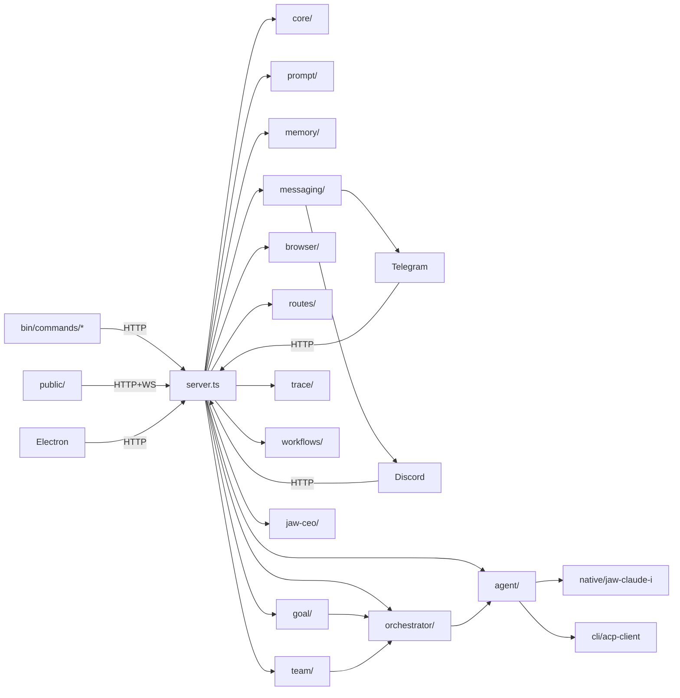

> 📚 [INDEX](INDEX.md) · [체크리스트 ↗](AGENTS.md) · **파일 트리 & 함수 레퍼런스**

# CLI-JAW — Source Structure & Function Reference

> 마지막 검증: 2026-06-04 (Pi RPC runtime 통합 후 실제 코드베이스 재측정)
> `server.ts` 995L / `src/routes/` 23 files (registrars + helper modules, 193 route handlers) / `src/cli/handlers*.ts` 397L + 499L + 97L + 57L + workflow 370L / `src/cli/api-auth.ts` 45L / `src/workflows/` 21 files + 3 subdirs (checkpoint/permissions/context-map) / `src/agent/` 28 root TS + `spawn/` 3 files + `events/` 12 files (spawn.ts 2138L + pi-runtime.ts 403L + lifecycle-handler.ts 951L + kiro-runtime.ts 377L + kiro-auth.ts 230L + kiro-models.ts 98L + cursor-runtime.ts 239L) / `src/goal/` 4 files (347L) / `src/goal-run/` 5 files (289L) / `src/trace/` 3 files (276L) / `src/team/` 5 files (323L, team dispatch planner/collector/preflight) / `src/jaw-ceo/` 16 files (2614L, OpenAI Realtime CEO channel) / `src/shared/` 2 files (253L) / `src/manager/` 80+ TS files (dashboard + board/notes/search/schedule/reminders/connector/routes/memory/git) / `src/browser/web-ai/` 59 TS files + `adaptive-fetch/` 18 files (2820L) / `src/types/` 3 files (296L) / `bin/commands/` 26 top-level ts files + `tui/` 9 helper files / `electron/` Electron tray app (26 TS files, 2947L) / `native/jaw-claude-i/` 11 Rust source files (1703L)
>
> 상세 모듈 문서는 [서브 문서](#서브-문서)를 참조하세요.

---

## File Tree

```text
cli-jaw/
├── server.ts                 ← Express 라우트 base + auth/CORS/rate-limit + WS bootstrap + `register*Routes()` glue + startup stale orc_state guard + graceful shutdown(closeDb) + employee migration + seed defaults + registerAvatarRoutes + async listen bootstrap (await initActiveMessagingRuntime) + orphaned jaw-emp-* cleanup + clearAllEmployeeSessions startup + no-store Vite index serving (1000L)
├── lib/                      ← 외부 통합/공용 헬퍼 (5 root files + mcp/ 8 files)
│   ├── mcp-sync.ts           ← MCP 통합 + 스킬 복사 + softResetSkills + runSkillReset + trusted repair gate + clone cooldown (73L)
│   ├── mcp/                  ← MCP 모듈 분리 (8 files)
│   │   ├── mcp-registry.ts   ← MCP 레지스트리 관리 (112L)
│   │   ├── format-converters.ts ← CLI별 MCP 포맷 변환 (239L)
│   │   ├── skills-distribution.ts ← 스킬 배포/복사 로직 (331L)
│   │   ├── skills-reset.ts   ← 스킬 리셋 core (269L)
│   │   ├── skills-symlinks.ts ← 스킬 심링크 관리 (373L)
│   │   ├── skills-utils.ts   ← 스킬 유틸리티 (198L)
│   │   ├── unified-config.ts ← 통합 MCP 설정 (99L)
│   │   └── mcp-install.ts    ← MCP 설치 헬퍼 (99L)
│   ├── upload.ts             ← 파일 업로드 + Telegram 다운로드 guards(status/timeout/maxBytes) + 유니코드 파일명 (205L)
│   ├── stt.ts                ← 음성인식 엔진 (Gemini REST → Whisper fallback, settings.json 연동, mimeType 파라미터) (231L)
│   ├── quota-copilot.ts      ← Copilot 할당량 조회 (env → file cache → gh auth token → keychain, execFileSync 보안, source 계정 바인딩) + refreshCopilotFromKeychain (328L)
│   └── mime-detect.ts        ← MIME 타입 감지 헬퍼 (67L)
├── src/
│   ├── core/                 ← 의존 0 인프라 계층 (27 files)
│   │   ├── config.ts         ← JAW_HOME, settings, APP_VERSION + migrateSettings legacy Claude model normalization + avatar settings deep merge + default `settings.pi` + corrupt settings backup + CLI 탐지 re-export hub (528L)
│   │   ├── cli-detection.ts  ← CLI 탐지 + `pi` npm-exec fallback + `kiro-code`(`kiro-cli` binary)/`claude-e`/`ai-e` helper `--idle-timeout-ms` compatibility probe + local package release/debug candidates (282L)
│   │   ├── compact.ts        ← compact 헬퍼 (COMPACT_MARKER_CONTENT, managed summary builder, cutoff logic, harvestGitGrep + harvestChatGrep 1KB/1KB budget split) (702L)
│   │   ├── instance.ts       ← 인스턴스 ID, node/jaw 경로, 유닛명 sanitize (58L)
│   │   ├── db.ts             ← SQLite 스키마 + prepared statements + trace + tool_log + working_dir migration + closeDb() WAL checkpoint + checkOrphanedWal + busy_timeout + clearMessagesScoped + queued_messages table + model-aware clearEmployeeSession + getRecentMessagesLite + searchMessages(days+recent scope) + getMessageContext(±N range) (388L)
│   │   ├── chat-sessions.ts  ← 채팅 세션 CRUD + 활성 세션 전환 (80L)
│   │   ├── bus.ts            ← WS + 내부 리스너 broadcast (36L)
│   │   ├── logger.ts         ← 로거 유틸 (27L)
│   │   ├── i18n.ts           ← 서버사이드 번역 (90L)
│   │   ├── employees.ts      ← Employee 시드/CRUD 공용 로직 + 정적(코드 정의) 직원(Control 등) 등록 + DEFAULT_EMPLOYEES (265L)
│   │   ├── main-session.ts   ← 메인 세션 authoritative CLI/clear-state helper + clearBossSessionOnly (185L)
│   │   ├── message-summary.ts ← message preview/summary helper (44L)
│   │   ├── path-expand.ts    ← shell-style path expansion helper (12L)
│   │   ├── runtime-settings.ts ← settings side effects 통합 helper (175L)
│   │   ├── runtime-settings-gate.ts ← settings mutation in-flight gate (41L)
│   │   ├── codex-config.ts   ← Codex config.toml context window sync (78L)
│   │   ├── runtime-path.ts   ← buildServicePath() PATH 보강 (nvm/fnm/homebrew/volta/asdf/cargo/bun/yarn/pnpm 14+ dirs) (78L)
│   │   ├── cli-detect.ts     ← PATH 후보 spawnability 검사 + rejected candidate reason 수집 (232L)
│   │   ├── browser-open.ts   ← 브라우저 open 정책/명령 실행 helper (47L)
│   │   ├── browser-open-default.ts ← OS/headless 기본 open 여부 판별 (10L)
│   │   ├── strip-undefined.ts ← 설정/응답 객체 undefined 제거 helper (16L)
│   │   ├── boss-auth.ts      ← boss/employee scope 분리용 auth helper (42L)
│   │   ├── claude-install.ts ← Claude CLI 설치 상태 점검 helper (33L)
│   │   ├── launchd-cleanup.ts ← launchd stale plist / runtime cleanup (16L)
│   │   ├── launchd-plist.ts  ← launchd plist 생성 helper (61L)
│   │   ├── tcc.ts            ← macOS TCC / screen-recording 권한 점검 (55L)
│   │   └── settings-merge.ts ← perCli/activeOverrides/pi deep merge (52L)
│   ├── agent/                ← CLI 에이전트 런타임 (28 root files + events/ 12 files + spawn/ 3 files)
│   │   ├── spawn.ts          ← CLI spawn + ACP/Codex App/Pi RPC/AGY/Kiro plain text/log session capture/claude-e helper 분기 + v2 SQLite session resume + 큐 + 메모리 flush + 429 retry timer + isAgentBusy/isSteerInProgress + buildHistoryBlock compact cutoff + working_dir scoping + enqueue→processQueue race fix + QueueItem persistent DB queue + makeCleanEnv PATH augment (2195L)
│   │   ├── spawn/            ← spawn 서브모듈 (3 files)
│   │   │   ├── queue.ts      ← QueueItem persistent DB queue + processQueue race fix + enqueue/dequeue (350L)
│   │   │   ├── resume.ts     ← session resume logic + stale resume detection (84L)
│   │   │   └── process-kill.ts ← child process kill helper (22L)
│   │   ├── events/           ← NDJSON 이벤트 파서 모듈 분리 (12 files)
│   │   │   ├── index.ts      ← 이벤트 라우터 + logEventSummary + stepRef correlation + compact event parsing + duplicate suppression (353L)
│   │   │   ├── helpers.ts    ← summarizeToolInput(type-safe) + toolType/detail 필드 + flushClaudeBuffers (322L)
│   │   │   ├── claude.ts     ← Claude thinking_delta/input_json_delta 버퍼 + content_block_stop flush (264L)
│   │   │   ├── opencode.ts   ← OpenCode event adapter (196L)
│   │   │   ├── grok.ts       ← Grok throttled visible thinking + event adapter (344L)
│   │   │   ├── codex.ts      ← Codex item.started/completed + toolLog running→done dedup (96L)
│   │   │   ├── acp.ts        ← ACP session/update 이벤트 (219L)
│   │   │   ├── cursor.ts     ← Cursor event adapter (196L)
│   │   │   ├── gemini.ts     ← Gemini event adapter (117L)
│   │   │   ├── summary.ts    ← event summary formatters (139L)
│   │   │   ├── tool-labels.ts ← tool name→label mapping (343L)
│   │   │   └── types.ts      ← event type definitions (23L)
│   │   ├── spawn-env.ts      ← spawn용 child env 빌더 (AGY NO_COLOR, OpenCode/Gemini permissions config 주입 등, 148L)
│   │   ├── args.ts           ← CLI별 인자 빌더 + AGY print-mode/`--log-file`/`--conversation` resume args + `claude-e` helper run/resume args + Pi session bucket 분리 (428L)
│   │   ├── pi-runtime.ts     ← Pi profile 정규화 + isolated `PI_CODING_AGENT_DIR` models/settings 생성 + `pi --offline --list-models` discovery + `pi --mode rpc` JSONL parser/spawner (403L) ✨
│   │   ├── lifecycle-handler.ts ← child lifecycle + fallback/retry + queue resume orchestration + clearEmployeeSession on resume failure + stale resume fresh retry + kickGoalContinuation export + clearGoalTimers (951L)
│   │   ├── kiro-auth.ts      ← Kiro CLI auth store reader (resolveKiroDataPath, readKiroAuthFromStore, resolveKiroProfileArn, regionFromProfileArn, listKiroConversationIdsForCwd, resolveKiroSessionIdAfterSpawn, extractKiroSessionIdFromV2Store) (230L)
│   │   ├── kiro-models.ts    ← Kiro live model inventory (KiroModelEntry, KiroModelInventory, parseKiroModelListJson, fetchKiroModelInventory) (98L)
│   │   ├── kiro-runtime.ts   ← Kiro plain-text stdout parser + session capture (isKiroPlainTextCli, processKiroStdoutChunk, flushKiroStdoutContext, appendKiroStdoutChunk, captureKiroSessionIdAfterExit, stripKiroAnsi, parseKiroAssistantText, isKiroStaleSessionOutput, isKiroResumeDegradedOutput, KiroStreamEvent, KiroStdoutContext) (377L)
│   │   ├── cursor-runtime.ts ← Cursor CLI event adapter + session management (239L) ✨
│   │   ├── agy-runtime.ts    ← AGY timeout stdout 판별/메시지 정규화 + stdout/log conversation id 추출 (26L)
│   │   ├── claude-e-runtime.ts ← `jaw_runtime` helper event를 legacy `agent:claude-i:*` broadcast로 변환 (44L)
│   │   ├── alert-escalation.ts ← alert escalation event helper (86L)
│   │   ├── cli-helpers.ts    ← Claude-like CLI 판별 helper (7L)
│   │   ├── codex-app-client.ts ← Codex App stdio server client (274L)
│   │   ├── codex-app-events.ts ← Codex App turn/tool/message event adapter (291L)
│   │   ├── error-classifier.ts ← stderr/result 기반 에러 분류 헬퍼 (52L)
│   │   ├── grok-trace-backfill.ts ← Grok trace backfill helper (167L) ✨
│   │   ├── live-run-state.ts ← active run snapshot / hydrate helper (64L)
│   │   ├── memory-flush-controller.ts ← assistant 완료 후 메모리 flush lock + trigger 제어 (185L)
│   │   ├── opencode-diagnostics.ts ← OpenCode permissions/env audit + raw event 진단 헬퍼 (156L)
│   │   ├── session-persistence.ts ← main-session persistence policy + ownership generation (74L)
│   │   ├── resume-classifier.ts ← stale resume signature classifier (81L)
│   │   ├── smoke-detector.ts ← smoke response 감지 + auto-continue 판단 (148L)
│   │   ├── tool-timeout.ts   ← tool inactivity timeout helper (33L)
│   │   ├── watchdog.ts       ← idle/progress watchdog + 4h absolute hard cap with progress deadline extension (104L)
│   │   └── events.ts         ← legacy re-export stub → events/ 모듈 (15L)
│   ├── messaging/            ← 통합 메시징 런타임 (6 files)
│   │   ├── runtime.ts        ← 채널 lifecycle (init/shutdown/restart) + transport registry (146L)
│   │   ├── send.ts           ← 통합 아웃바운드 메시지 라우팅 (ChannelSendRequest, 다중 채널 send 지원) (216L)
│   │   ├── channel-health.ts ← 채널 헬스 체크 helper (70L) ✨
│   │   ├── send-result.ts    ← send result type helper (14L) ✨
│   │   ├── session-key.ts    ← 세션 키 헬퍼 (27L)
│   │   └── types.ts          ← MessengerChannel, OutboundType, RemoteTarget 타입 (27L)
│   ├── orchestrator/         ← 직원 오케스트레이션 + 인터페이스 통합 (14 files)
│   │   ├── state-machine.ts ← IPABCD 상태 머신 (I=Interview pre-plan) + broadcast(state,title) + worklog 타이틀 파싱 + employee terminology + OrcContext.workingDir + OrcContext.interview + Project root dispatch contract (612L)
│   │   ├── pipeline.ts       ← IPABCD orchestration (explicit entry only) + interview first-turn detection + plan context persistence + memorySnapshot injection + reset clears boss session + OrcContext workingDir init + Approved Plan Project root guard (538L)
│   │   ├── distribute.ts     ← runSingleAgent + buildPlanPrompt + parallel helpers + tiered findEmployee + employee resume diagnostics (583L)
│   │   ├── parser.ts         ← triage + subtask JSON + verdict 파싱 + isResetIntent (176L)
│   │   ├── gateway.ts        ← submitMessage 통합 진입점 (WebUI+CLI+TG+Discord 공통) + working_dir scoped insertMessage (155L)
│   │   ├── collect.ts        ← orchestrateAndCollect (bot.ts에서 분리) (66L)
│   │   ├── scope.ts          ← 현재 단일 'default' scope를 반환하는 stub (17L)
│   │   ├── worker-monitor.ts ← Worker stall detection — activity timestamps + stall/disconnect/timeout callbacks (58L)
│   │   ├── worker-progress.ts ← 직원 progress safe-summary sanitizer + current/previous snapshot types (58L)
│   │   ├── worker-registry.ts ← Worker 프로세스 레지스트리 + progress current/previous memory retention (241L)
│   │   ├── workspace-context.ts ← Project root/path hint resolver for employee dispatch context (95L)
│   │   ├── friction.ts       ← Interview friction/stagnation detector (76L)
│   │   ├── seed.ts           ← Interview seed/ontology builder (107L)
│   │   └── sanitize.ts       ← Interview tracker strip helper (51L)
│   ├── prompt/               ← 프롬프트 조립 (4 files + templates/ 10 files)
│   │   ├── builder.ts        ← A-1/A-2 + 스킬 + 직원 프롬프트 v2 + promptCache (4-segment key: emp:role:phase:workingDir) + on-demand dev skill path contract + advanced memory mode branch + task snapshot injection + dashboard-connector anchor preserve (817L)
│   │   ├── runtime-context.ts ← 런타임 컨텍스트 주입 (RuntimeContextEntry, loadEntries, getActiveEntries, addEntry, removeEntry, clearAll, buildInjectionBlock) (80L)
│   │   ├── soul-bootstrap-prompt.ts ← LLM 기반 soul.md 개인화 부트스트랩 프롬프트 빌더 (52L)
│   │   ├── template-loader.ts ← 프롬프트 템플릿 로더 (50L)
│   │   └── templates/        ← 프롬프트 템플릿 (a1-system.md, a2-default.md, employee.md, orchestration.md, control-system.md, worker-context.md, vision-click.md, skills.md, heartbeat-*.md)
│   ├── cli/                  ← 커맨드 시스템 (18 root files + tui/ 18 files)
│   │   ├── commands.ts       ← 슬래시 커맨드 레지스트리 + workflow metadata + 디스패처 + 파일경로 필터 + /commands alias /cmd + /orchestrate alias /pabcd + /compact + /plan + artifact persistence (417L)
│   │   ├── handlers.ts       ← core command handlers + runtime/completion re-export hub + compact re-export + unknown command recovery payload (409L)
│   │   ├── handlers-runtime.ts ← memory/browser/prompt/quit/file/steer/forward/fallback/flush/ide/orchestrate 핸들러 + `LEGACY_MODEL_CLI_HINTS` (499L)
│   │   ├── handlers-completions.ts ← `/model` `/cli` `/skill` `/employee` `/browser` `/fallback` `/flush` 인자 자동완성 헬퍼 (97L)
│   │   ├── handlers-workflows.ts ← `/plan` PABCD P 안내 + `/interview` `/deliberate` `/planaudit` prompt handlers + `/review` project-dir workflow + `/goal` gated stub + `/goal run` preflight gate (494L)
│   │   ├── handlers-project.ts ← `/project` 커맨드 핸들러 (projectDirs 관리) (57L) ✨
│   │   ├── api-auth.ts       ← CLI→server Bearer token bootstrap (`getCliAuthToken`, `authHeaders`, `cliFetch`) (45L)
│   │   ├── claude-models.ts  ← Claude 정규 모델셋 (CLAUDE_CANONICAL_MODELS, CLAUDE_LEGACY_VALUE_MAP) + migration/validation helpers (78L)
│   │   ├── compact.ts        ← /compact 슬래시 커맨드 핸들러 (Claude native + managed 경로 분기) + working_dir scoped (139L)
│   │   ├── registry.ts       ← 13개 CLI/모델 단일 소스 + canonical defaults + top-level `pi`/`agy`/`cursor`/`ai-e`/`claude-e`/`kiro-code` (231L)
│   │   ├── registry-live.ts  ← buildLiveCliRegistry — Kiro model inventory 동적 병합 (fetchKiroModelInventory → registry clone) (17L)
│   │   ├── readiness.ts      ← CLI별 인증/설치 상태 점검 + Pi npm-exec readiness + AGY runtime auth hint + `claude-e` underlying Claude auth/readiness bridge (CliReadiness[]) (170L)
│   │   ├── acp-client.ts     ← Copilot ACP JSON-RPC 클라이언트 (382L)
│   │   ├── command-context.ts ← 공유 커맨드 컨텍스트 팩토리 + runSkillReset 위임 + regenerateB 유지 (139L)
│   │   ├── connector.ts      ← dashboard connector CLI API bridge (board/notes/reminders/audit) (73L)
│   │   ├── reminders.ts      ← local reminders CLI action helpers (35L)
│   │   ├── types.ts          ← CLI helper shared result/shape 타입 + workflow command/artifact/recovery metadata contract (202L)
│   │   └── tui/              ← TUI 모듈 (18 files)
│   │       ├── store.ts      ← TuiStore (transcript + overlay 상태 통합), OverlayState + SelectorState (68L)
│   │       ├── transcript.ts ← TranscriptItem union (user/assistant/status) + TranscriptState + 6 mutation 함수 (57L)
│   │       ├── composer.ts   ← Issue #66 pasted-text composer state + bracketed paste parser + slash gate + PasteCollapseConfig (374L)
│   │       ├── overlay.ts    ← help overlay + command palette + choice selector 렌더링 (581L)
│   │       ├── keymap.ts     ← 키 입력 분류 (ctrl-c/ctrl-d/ctrl-k/enter/backspace/printable/escape) (36L)
│   │       ├── panes.ts      ← PaneState (openPanel, side, preferredWidth), PanelKind 6종 (53L)
│   │       ├── shell.ts      ← ShellLayout 계산 + scroll region setup/cleanup + ensureSpaceBelow (83L)
│   │       ├── renderers.ts  ← visualWidth (CJK 2-cell) + clipTextToCols ANSI-safe 자르기 (71L)
│   │       ├── mode.ts       ← TUI mode state (simple/fullscreen) (34L) ✨
│   │       ├── file-mention.ts ← file mention autocomplete helper (76L) ✨
│   │       ├── editor.ts     ← external editor launch helper (37L) ✨
│   │       ├── text-buffer.ts ← TextBuffer class (cursor/insert/delete/selection) (167L) ✨
│   │       ├── theme.ts      ← TUI color theme definitions (124L) ✨
│   │       ├── diffview.ts   ← TUI diff view renderer (37L) ✨
│   │       ├── stream.ts     ← streaming text accumulator (56L) ✨
│   │       ├── markdown.ts   ← TUI markdown renderer (120L) ✨
│   │       ├── highlight.ts  ← TUI syntax highlight helper (83L) ✨
│   │       └── render/       ← TUI render sub-modules (5 files: frame 79L, layout 42L, mouse 27L, scheduler 42L, viewport 98L) ✨
│   ├── memory/               ← 데이터 영속화 + advanced memory runtime (14 files)
│   │   ├── advanced.ts       ← Advanced Memory re-export stub (1L)
│   │   ├── bootstrap.ts      ← legacy memory/bootstrap import + structured root 초기화 (517L)
│   │   ├── heartbeat.ts      ← Heartbeat 잡 스케줄 + cron/every timer orchestration + minute-slot dedupe + fs.watch (209L)
│   │   ├── heartbeat-schedule.ts ← Heartbeat schedule normalize + cron validate/match + timezone validate + immediate cron loop helper (410L)
│   │   ├── identity.ts       ← `shared/soul.md` 관리 + soul runtime helper (86L)
│   │   ├── indexing.ts       ← FTS5/BM25 reindex + indexed file/chunk 상태 집계 (569L)
│   │   ├── injection.ts      ← memory injection policy + advanced/basic search routing (69L)
│   │   ├── keyword-expand.ts ← search keyword expansion + provider config normalize (98L)
│   │   ├── memory.ts         ← Persistent Memory grep 기반 (164L)
│   │   ├── reflect.ts        ← episode → shared/procedures reflection + promoted fact 정리 (379L)
│   │   ├── runtime.ts        ← Advanced Memory 런타임: bootstrap/import/FTS5 인덱스/BM25 검색/task snapshot/delta reindex (374L)
│   │   ├── shared.ts         ← file/meta/frontmatter 공용 헬퍼 (256L)
│   │   ├── synonyms.ts       ← keyword synonym expansion helper (67L) ✨
│   │   └── worklog.ts        ← Worklog CRUD + phase matrix (200L)
│   ├── telegram/             ← Telegram 인터페이스 (4 files)
│   │   ├── bot.ts            ← Telegram 봇 + forwarder lifecycle + origin 필터링 + inbound download size hints + voice 핸들러 등록 (677L)
│   │   ├── voice.ts          ← 음성 메시지 → guarded download → STT → tgOrchestrate 파이프라인 (40L)
│   │   ├── forwarder.ts      ← 포워딩 헬퍼 (escape, chunk, createForwarder) (123L)
│   │   └── telegram-file.ts  ← Telegram 파일 전송 + 재시도 + 사이즈 검증 (147L)
│   ├── discord/              ← Discord 인터페이스 (6 files)
│   │   ├── bot.ts            ← Discord 봇 + transport 등록 + message/attachment 핸들러 (407L)
│   │   ├── commands.ts       ← Discord slash command 등록 + 핸들러 (118L)
│   │   ├── send-only-client.ts ← Discord send-only client (webhook/DM fallback) (90L) ✨
│   │   ├── channel-types.ts  ← Discord channel type helpers (29L) ✨
│   │   ├── forwarder.ts      ← Discord 포워딩 헬퍼 (escape, chunk) (45L)
│   │   └── discord-file.ts   ← Discord 파일 전송 (56L)
│   ├── browser/              ← Chrome CDP 제어 + web-ai 자동화 + adaptive-fetch
│   │   ├── connection.ts     ← Chrome 탐지/launch/CDP 연결 + readiness polling + retry + headless + runtime diagnostics/orphan cleanup + activePort/active-tab 상태 관리 (817L)
│   │   ├── launch-policy.ts  ← browser start mode 정규화 + agent/debug/manual launch policy (51L)
│   │   ├── actions.ts        ← snapshot/click/type/navigate/screenshot + browser primitive actions (516L)
│   │   ├── primitives.ts     ← low-level CDP primitives (294L)
│   │   ├── vision.ts         ← vision-click 파이프라인 + Codex provider + guardrail options (204L)
│   │   ├── runtime-diagnostics.ts ← runtime diagnostics helper (130L)
│   │   ├── runtime-owner.ts  ← browser runtime owner management (135L)
│   │   ├── runtime-owner-store.ts ← runtime owner store (55L)
│   │   ├── runtime-orphans.ts ← orphan process cleanup (150L)
│   │   ├── tab-lifecycle.ts  ← tab lifecycle management (212L)
│   │   ├── index.ts          ← re-export hub (34L)
│   │   ├── adaptive-fetch/   ← Adaptive web fetch 서브모듈 (18 files, 2820L) ✨
│   │   │   ├── index.ts      ← adaptive fetch orchestrator (524L)
│   │   │   ├── safety.ts     ← URL/content safety checks (244L)
│   │   │   ├── endpoint-resolvers.ts ← reader API endpoint resolution (310L)
│   │   │   ├── browser-escalation.ts ← fallback to browser fetch (153L)
│   │   │   └── ... (14 more: fetcher, content-scorer, validators, metadata, transforms, trace, waf-profiles, browser-session, human-loop, output, browser-runtime, third-party-readers, reader-adapters, challenge-detector)
│   │   └── web-ai/           ← Web AI 브라우저 자동화 (59 TS files, ~12000L; ChatGPT/Gemini/Grok 멀티벤더 + resolver/source-audit/observation helpers + context-pack + tab lifecycle/pool)
│   ├── ide/                   ← IDE 연동 (jaw chat TUI 전용)
│   │   └── diff.ts            ← git diff 감지 + IDE diff 뷰 + 서브모듈 재귀 + fingerprint 비교 (238L)
│   ├── routes/               ← Express 라우트 추출 (23 files: registrar + helper modules, 193 route handlers)
│   │   ├── _http-error.ts    ← route-level HTTP error helper (16L)
│   │   ├── types.ts          ← `AuthMiddleware` shared type (3L)
│   │   ├── employees.ts      ← employee CRUD 라우트 (105L)
│   │   ├── heartbeat.ts      ← heartbeat read/write 라우트 (47L)
│   │   ├── skills.ts         ← skill list/enable/disable/reset 라우트 (89L)
│   │   ├── jaw-memory.ts     ← jaw memory search/read/list/save/init/reflect/flush/soul/soul-activate/bootstrap 라우트 (282L)
│   │   ├── jaw-ceo.ts        ← Jaw CEO channel/session support routes (321L) ✨
│   │   ├── i18n.ts           ← locale bundle 라우트 (35L)
│   │   ├── orchestrate.ts    ← IPABCD reset/state/workers/snapshot/queue cancel/queue steer async accept/dispatch/worker result/state PUT 라우트 (770L)
│   │   ├── memory.ts         ← memory status/KV/files/settings 라우트 (192L)
│   │   ├── settings.ts       ← settings/prompt/heartbeat-md/MCP/registry/status/quota/copilot + Pi profile register/model discovery 라우트 + CLI_KEYS 기반 quota parity/status-only metadata (400L)
│   │   ├── messaging.ts      ← upload/file-open/voice/telegram/channel/discord send 라우트 (249L)
│   │   ├── avatar.ts         ← Agent/User 아바타 이미지 업로드/서빙/삭제 + settings.json 메타 저장 + safeResolveUnder 경로 보호 (146L)
│   │   ├── quota.ts          ← Copilot/Claude/Codex/Gemini/OpenCode quota helper readers + Claude 429 cache (459L)
│   │   ├── quota-kiro-reverse.ts ← Kiro/CodeWhisperer quota reader (239L)
│   │   ├── quota-agy-reverse.ts ← AGY reverse quota reader (160L)
│   │   ├── quota-cursor-dashboard.ts ← Cursor dashboard quota reader (203L)
│   │   ├── goal.ts           ← goal CRUD + kickGoalContinuation route (registerGoalRoutes) (139L)
│   │   ├── goal-run.ts       ← goal-run execution routes (83L)
│   │   ├── runtime-context.ts ← runtime context route helpers (46L)
│   │   ├── security-audit.ts ← security audit route registrar (18L)
│   │   ├── traces.ts         ← public trace summary/events read routes (80L)
│   │   └── browser.ts        ← 브라우저 API 라우트 + `cdpPort(req)` 포트 우선순위 + primitive/tab/debug/doctor/cleanup/web-ai routes (478L)
│   ├── security/             ← 보안 입력 검증 (4 files)
│   │   ├── path-guards.ts    ← assertSkillId, assertFilename, assertMemoryRelPath, assertSendFilePath, safeResolveUnder (126L)
│   │   ├── decode.ts         ← decodeFilenameSafe (21L)
│   │   ├── network-acl.ts    ← isPrivateIP, isAllowedHost, isAllowedOrigin, originMatchesHost, extractHost (131L)
│   │   └── security-audit-log.ts ← SQLite-backed security audit event log (162L) ✨
│   ├── http/                 ← 응답 계약 (3 files)
│   │   ├── response.ts       ← ok(), fail() 표준 응답 (25L)
│   │   ├── async-handler.ts  ← asyncHandler 래퍼 (14L)
│   │   └── error-middleware.ts ← notFoundHandler, errorHandler (26L)
│   ├── types/                ← 공유 타입 정의 (3 files, 296L)
│   │   ├── agent.ts          ← ToolEntry, SpawnContext, SpawnResult 인터페이스 (117L)
│   │   ├── cli-engine.ts     ← CliEngine union + registry key tuple + `agy`/`ai-e`/`claude-e`/`kiro-code` discriminators (56L)
│   │   └── cli-events.ts     ← CLI event record/discriminator helpers (154L)
│   ├── command-contract/     ← 커맨드 인터페이스 통합 (3 files)
│   │   ├── catalog.ts        ← COMMANDS → capability map 확장 (45L)
│   │   ├── policy.ts         ← getVisibleCommands, getTelegramMenuCommands (39L)
│   │   └── help-renderer.ts  ← renderHelp list/detail mode (44L)
│   ├── goal/                 ← Goal autonomy 시스템 (4 files, 347L)
│   │   ├── heartbeat.ts      ← buildGoalContinuation (autonomy override) + shouldHeartbeatContinueGoal + getGoalContinuationPrompt + goal pause audit enforcement (128L)
│   │   ├── runtime.ts        ← WorkflowRuntimeSnapshot + buildRuntimeSnapshot (goal + PABCD + worker registry 통합 스냅샷) (55L)
│   │   ├── store.ts          ← GoalState CRUD (getActiveGoal, setGoal, updateGoal, completeGoal, cancelGoal, pauseGoal, resumeGoal, clearGoal, resetGoalStore, goalHasCompletionEvidence, getGoalHistory) (174L)
│   │   └── types.ts          ← GoalStatus, GoalBudget, GoalCheckpoint, GoalState, GoalHistory, GoalEvent 타입 (42L)
│   ├── goal-run/             ← Goal-run 실행 제어 (5 files, 289L)
│   │   ├── controller.ts     ← goal-run execution controller (123L)
│   │   ├── events.ts         ← goal-run workflow event builders (38L)
│   │   ├── failure-matrix.ts ← goal-run failure classification (37L)
│   │   ├── policy.ts         ← goal-run preflight gates + budget check (56L)
│   │   └── types.ts          ← GoalRunMode, GoalRunBudget, GoalRunSafetyGate, GoalRunState 타입 (35L)
│   ├── trace/                ← Trace 이벤트 영속화 (3 files, 276L)
│   │   ├── store.ts          ← startTraceRun + appendTraceEvent + stampTraceTool + finalizeTraceRun + pruneTraceEvents (195L)
│   │   ├── types.ts          ← TraceRunInput, TraceEventInput, TracePointer, TraceRunRow 타입 (36L)
│   │   └── redact.ts         ← trace event redaction helpers (45L)
│   ├── shared/               ← 공유 유틸리티 (2 files) ✨
│   │   ├── tool-log-sanitize.ts ← tool log sanitization helpers (205L)
│   │   └── shell-command-display.ts ← shell command display formatter (48L)
│   ├── manager/              ← Multi-instance 대시보드 매니저 (80+ TS files; board/notes/search/schedule/reminders/connector/routes/memory/git 서브모듈)
│   ├── team/                 ← Team dispatch planner (5 files, 323L) ✨
│   │   ├── planner.ts        ← team task planning logic (75L)
│   │   ├── collector.ts      ← team result collector (66L)
│   │   ├── dispatcher.ts     ← team dispatch executor (49L)
│   │   ├── preflight.ts      ← team dispatch preflight checks (58L)
│   │   └── types.ts          ← team dispatch types (75L)
│   ├── jaw-ceo/              ← Jaw CEO OpenAI Realtime channel (16 files, 2614L) ✨
│   │   ├── realtime-sideband.ts ← OpenAI Realtime API sideband connection (392L)
│   │   ├── coordinator.ts    ← CEO session coordinator (222L)
│   │   ├── coordinator-admin.ts ← admin commands for CEO channel (340L)
│   │   ├── coordinator-workers.ts ← CEO worker management (266L)
│   │   ├── coordinator-completions.ts ← CEO completion handling (207L)
│   │   ├── coordinator-realtime-tools.ts ← realtime tool definitions (107L)
│   │   ├── coordinator-types.ts ← coordinator type definitions (52L)
│   │   ├── coordinator-utils.ts ← coordinator utilities (103L)
│   │   ├── store.ts          ← CEO session store (229L)
│   │   ├── types.ts          ← CEO channel types (179L)
│   │   ├── docs-edit.ts      ← document editing via CEO (156L)
│   │   ├── completion.ts     ← completion helpers (131L)
│   │   ├── policy.ts         ← CEO access policy (109L)
│   │   ├── confirmations.ts  ← user confirmation flow (50L)
│   │   ├── openai-key.ts     ← OpenAI key resolver (32L)
│   │   └── transcript-persistence.ts ← transcript save/load (39L)
│   ├── reminders/            ← Reminders bridge (2 files) ✨
│   │   ├── jaw-reminders-bridge.ts ← jaw↔dashboard reminders bridge (363L)
│   │   └── types.ts          ← reminder types (69L)
│   └── workflows/            ← workflow helper + employee boundary/handoff/scope-sandbox + deliberate/planaudit/review/runtime/guards (18 root files + 3 subdirs)
│       ├── artifacts.ts      ← JAW_HOME workflow artifact cache + project key/path safety + unknown command recovery artifact (172L)
│       ├── plan.ts           ← `/plan` compatibility artifact/text builder (91L)
│       ├── scope-sandbox.ts  ← normalizeScope + isProtectedPath + postDispatchDiffCheck (71L)
│       ├── employee-boundary.ts ← assertBossOnlyDispatch + assertNoImplementationDelegation + assertReadOnlyAudit (42L)
│       ├── handoff.ts        ← buildHandoff (mutable option) + hasImplementationDelegation (64L)
│       ├── deliberate.ts     ← `/deliberate` workflow handler (85L)
│       ├── planaudit.ts      ← `/planaudit` workflow handler (82L)
│       ├── review.ts         ← `/review` projectDirs/recent-context scope resolution + Markdown report path + fix/dispatch steer prompt (195L)
│       ├── competitive-gap.ts ← competitive gap analysis workflow (113L)
│       ├── runtime.ts / runtime-guards.ts / guards.ts / events.ts / status.ts / context.ts / index.ts / types.ts / browser-web-ai.ts / web-ai-guards.ts
│       ├── checkpoint/       ← checkpoint store + types (2 files, 59L) ✨
│       ├── permissions/      ← permission policy + types (2 files, 80L) ✨
│       └── context-map/      ← context map builder (1 file, 71L) ✨
├── public/                   ← Web UI (Vite 8 + ES Modules, ~82075L)
│   ├── index.html            ← 뼈대 (1136L)
│   ├── manifest.json         ← PWA 매니페스트
│   ├── sw.js                 ← Service Worker 오프라인 캐시
│   ├── css/                  ← 11 files (variables/layout/markdown/chat/diagram/orc-state/sidebar/modals/tool-ui/trace-drawer)
│   ├── locales/              ← i18n (ko/en/ja/zh .json)
│   └── js/                   ← 75 .ts files (root 17 + features/ 43 + diagram/ 3 + render/ 12, 전 파일 TypeScript)
├── electron/                 ← Electron tray background app (26 TS files, 2947L) ✨
│   ├── package.json / electron-builder.yml / electron.vite.config.ts
│   └── src/
│       ├── main/index.ts     ← Electron main process — BrowserWindow + tray + jaw server spawn + deep-link + IPC (1053L)
│       ├── main/lib/         ← 23 helper modules (jaw-spawn 196L, tray-manager 154L, terminal/ 185L, navigation-policy 112L, app-metrics 93L, folder/ipc 190L + dropped-paths 70L, health-check 78L, deep-link 78L, permissions, path-security, quit-progress, etc.)
│       └── preload/          ← preload scripts (index 112L + metrics 68L)
├── native/
│   └── jaw-claude-i/         ← Claude Interactive native helper (Rust, 11 src files, 1703L)
│       ├── Cargo.toml        ← Rust package/dependency/test profile
│       └── src/              ← main.rs(421L) + args/child/hook/protocol/transcript/config/terminal/cleanup/normalize/sanitize
├── bin/
│   ├── cli-jaw.ts            ← 27개 user-facing 서브커맨드 라우팅 + --home flag (224L)
│   ├── _http-client.ts       ← shared HTTP client helper (35L) ✨
│   ├── star-prompt.ts        ← `gh` 기반 GitHub star 1회 프롬프트 (129L)
│   ├── postinstall.ts        ← npm install 후 CLI 런타임 + OfficeCLI 자동설치 + MCP + 스킬 + safe 가드 (1036L)
│   ├── helpers/help.ts       ← CLI help text helper (10L)
│   └── commands/             ← 26 top-level ts files + `tui/` 9 helper 모듈
│       ├── serve.ts          ← 서버 시작 (--port/--host/--open) + SIGINT child.kill('SIGINT') orphan fix (121L)
│       ├── dispatch.ts       ← 직원 호출 (pipe mode 호환) + batch dispatch + stale/non-JSON route diagnostics + worker result polling + ECONNREFUSED retry (469L)
│       ├── chat.ts           ← 터미널 채팅 TUI (3모드, locale bootstrap, refreshInfo, active model 표시, no-arg `/model`·`/cli` selector intercept, transcript 축적, overlay wiring, 292L)
│       ├── chat-search.ts    ← 채팅 메시지 히스토리 검색 (--days/--recent/--context/--limit, 70L)
│       ├── goal.ts           ← goal autonomy CLI (start/status/pause/resume/stop) (153L) ✨
│       ├── project.ts        ← project directory management CLI (169L) ✨
│       ├── lock.ts           ← instance lock/unlock for process protection (96L)
│       ├── history.ts        ← 채팅 히스토리 검색 CLI (65L)
│       ├── init.ts           ← 초기화 마법사 + --safe/--dry-run + --help (256L)
│       ├── doctor.ts         ← 진단 (다중 체크 + claude-i helper/underlying claude + headless 감지, --json) (735L)
│       ├── status.ts         ← 서버 상태 (--json) (86L)
│       ├── mcp.ts            ← MCP 관리 (install/sync/list/reset) (230L)
│       ├── skill.ts          ← 스킬 관리 (install/remove/info/list/reset soft·hard) (245L)
│       ├── employee.ts       ← 직원 관리 (list/reset, REST API 호출, JSON/table 출력, 82L)
│       ├── worker.ts         ← 직원 progress status/watch CLI + employee name/id resolver + safe-summary printer (196L)
│       ├── reset.ts          ← 전체 초기화 (MCP/스킬/직원/세션) (104L)
│       ├── clone.ts          ← 인스턴스 복제 (--from, --with-memory, regenerateB) (180L)
│       ├── memory.ts         ← 메모리 CLI (search/read/save/list/init, --chat 통합검색) (166L)
│       ├── launchd.ts        ← macOS LaunchAgent 관리 (243L)
│       ├── service.ts        ← 크로스 플랫폼 서비스 관리 (systemd/launchd/docker, 289L)
│       ├── orchestrate.ts    ← IPABCD 상태 제어 CLI (jaw orchestrate [I|P|A|B|C|D|reset]) (154L)
│       ├── browser.ts        ← 브라우저 CLI (primitive + tab/debug + web-ai delegator, 876L)
│       ├── browser-web-ai.ts ← `jaw browser web-ai` ChatGPT/Gemini/Grok 자동화 helper (305L)
│       ├── dashboard.ts      ← `jaw dashboard serve` + dashboard memory delegation (264L)
│       ├── dashboard-memory.ts ← `jaw dashboard memory` L2 federation CLI helper (243L)
│       ├── connector.ts      ← dashboard connector board/notes/reminders/audit CLI (216L)
│       ├── reminders.ts      ← local reminders list/add/done CLI (100L)
│       ├── dispatch-helpers.ts ← dispatch output unwrap helper (21L)
│       └── tui/              ← chat 터미널 TUI 분리 (9 files: api 84L, fullscreen-mode 264L, input-handler 430L, overlays 350L, renderer 135L, simple-mode 103L, tui-io 12L, types 111L, ws-handler 209L)
├── tests/                    ← 회귀 방지 테스트 (450+ .test.ts files: root 5 / unit 420+ / integration 10 / browser 5 / fixtures + smoke)
├── scripts/                  ← 도구 스크립트 (21+ files, TypeScript + Shell + CJS; build는 live manager restart/signal 없음)
├── officecli/                ← OfficeCLI 포크 서브모듈 (lidge-jun/OfficeCLI, Apache 2.0)
├── skills_ref/               ← 레퍼런스 스킬 (241 top-level dirs)
├── docs/                     ← 프로젝트 문서
├── README.md / README.ko.md / README.zh-CN.md / README.ja.md ← 다국어 README
├── tsconfig.json / tsconfig.frontend.json / tsconfig.build.json
├── types/
│   ├── frontend.d.ts         ← CDN 글로벌 타입 선언 (marked, hljs, katex, mermaid, DOMPurify)
│   └── global.d.ts           ← Node + Express 글로벌 타입
├── vite.config.ts            ← Vite 8 빌드 설정
├── package.json / pnpm-workspace.yaml
└── devlog/                   ← MVP 12 Phase + Post-MVP devlogs
```

### 런타임 데이터 (`~/.cli-jaw/`)

| 경로               | 설명                                      |
| ------------------ | ----------------------------------------- |
| `jaw.db`           | SQLite DB                                 |
| `settings.json`    | 사용자 설정                               |
| `mcp.json`         | 통합 MCP 설정 (source of truth)           |
| `prompts/`         | A-1, A-2, HEARTBEAT 프롬프트              |
| `memory/`          | Persistent memory (`MEMORY.md`, `daily/`) |
| `skills/`          | Active 스킬 (시스템 프롬프트 주입)        |
| `skills_ref/`      | Reference 스킬 (AI 참조용)                |
| `browser-profile/` | Chrome 사용자 프로필                      |
| `backups/`         | symlink 충돌 시 백업 디렉토리             |

npm 의존성: `express` ^5.2 · `ws` ^8.18 · `better-sqlite3` ^12.8 · `grammy` ^1.40 · `@grammyjs/runner` ^2.0 · `discord.js` ^14.25 · `node-fetch` ^3.3 · `playwright-core` ^1.58 · `react`/`react-dom` ^19.2 · `marked`/`katex`/`mermaid` 렌더링 스택

dev 의존성: `typescript` ^6.0 · `tsx` ^4.21 · `vite` ^8.0 · `@vitejs/plugin-react` ^5.2 · `jsdom` ^29.1 · `concurrently` ^9.2 · `@types/node` ^25 · `@types/express` ^5.0 · `@types/better-sqlite3` ^7.6 · `@types/ws` ^8.5

---

## 코드 구조 개요



### 디렉토리 의존 규칙

| 디렉토리 | 의존 대상 | 비고 |
|---|---|---|
| `core/` `security/` `http/` `shared/` | — | 의존 0 계층 |
| `browser/` | — | 독립 (CDP + adaptive-fetch + web-ai) |
| `messaging/` `cli/` `prompt/` `memory/` | core | 중간 계층 |
| `agent/` | core, prompt, orc, cli/acp, native | 핵심 허브 (Pi RPC/AGY/ACP/Codex/Kiro/Cursor) |
| `goal/` `goal-run/` `trace/` | core, orc, agent | 자율 실행 + 추적 |
| `team/` `jaw-ceo/` `reminders/` | core, orc, agent | 확장 모듈 |
| `workflows/` | orc, agent, core | Employee boundary + checkpoint |
| `orchestrator/` | core, prompt, agent | IPABCD + interview + worker |
| `telegram/` `discord/` | core, orc, agent, messaging | 외부 인터페이스 |
| `routes/` | core, browser, http, security, goal | Express 라우트 |
| `electron/` | server.ts (HTTP) | Electron tray app |
| `server.ts` | 전체 | 글루 레이어 |

---

## 핵심 주의 포인트

1.  **큐**: busy 시 queue → agent 종료 후 자동 처리 (persistent DB queue)
2.  **세션 무효화**: CLI 변경 시 session_id 제거
3.  **직원 dispatch**: B 프롬프트에 JSON subtask 포맷
4.  **메모리 flush**: `forceNew` spawn → 메인 세션 분리, threshold개 메시지만 요약
5.  **메모리 주입**: MEMORY.md = 매번, session memory = `injectEvery` cycle마다
6.  **에러 처리**: 429/auth 커스텀 메시지 + smart retry + fallback chain
7.  **IPv4 강제**: `--dns-result-order=ipv4first` + Telegram
8.  **MCP 동기화**: mcp.json → 지원되는 MCP-aware CLI 포맷 자동 변환 (lib/mcp/ 모듈)
9.  **이벤트 dedupe**: src/agent/events/ 모듈별 분리 — Claude/Codex/Grok/ACP/Cursor/Gemini/OpenCode
10. **Telegram/Discord origin**: `origin` 메타 기반으로 포워딩 판단
11. **Messaging runtime**: `src/messaging/` — 채널 추상화 (transport registry + unified send + session key + channel-health)
12. **CLI registry**: `src/cli/registry.ts` — 13개 CLI 런타임 정의. `pi`는 top-level RPC runtime, `kiro-code`는 `kiro-cli` binary; `registry-live.ts`가 동적 모델 목록 병합
13. **Copilot ACP**: JSON-RPC 2.0 over stdio, `session/update` 실시간 스트리밍
14. **Goal autonomy**: `src/goal/` — heartbeat continuation + store + runtime snapshot; `src/goal-run/` — execution controller + policy gates
15. **Kiro provider**: `kiro-auth.ts` (auth store reader) + `kiro-models.ts` (live inventory) + `kiro-runtime.ts` (stdout parser) + `registry-live.ts` (dynamic merge)
16. **Pi runtime**: `pi-runtime.ts` + `settings.pi` + `/api/pi/profiles/register` — first-class RPC runtime with isolated profile config and model discovery
17. **Interview enhancement**: `orchestrator/friction.ts` (5-level clarity + oscillation detection) + `seed.ts` (evidence-ref ontology) + `sanitize.ts` (tracker strip) + pipeline.ts budget gate
18. **TUI**: `src/cli/tui/` 18 files — transcript model + composer (paste collapse) + overlay (help/palette/selector) + text-buffer + theme + render/ sub-modules; `bin/commands/tui/` 9 files — fullscreen/simple mode + input-handler + ws-handler
19. **Electron tray**: `electron/` — background mode, jaw server spawn, tray menu, deep-link, terminal IPC, folder/drop path IPC, navigation policy, permission diagnostics
20. **Adaptive fetch**: `src/browser/adaptive-fetch/` 18 files — multi-strategy web fetch (direct → reader API → browser escalation) with WAF detection + content scoring
20. **Team dispatch**: `src/team/` — planner/collector/dispatcher/preflight for structured multi-employee coordination
21. **Jaw CEO**: `src/jaw-ceo/` — OpenAI Realtime API sideband channel + coordinator (admin/workers/completions/realtime-tools)

---

## 서브 문서

| 문서                                               | 범위                                                                          |
| -------------------------------------------------- | ----------------------------------------------------------------------------- |
| [🔧 infra.md](infra.md)                             | core/ (config·db·bus·logger·i18n·settings-merge) + security/ + http/          |
| [🌐 server_api.md](server_api.md)                   | server.ts · routes/ · REST API · WebSocket                                    |
| [⚡ commands.md](commands.md)                       | cli/ (commands·handlers·registry) + command-contract/                         |
| [🤖 agent_spawn.md](agent_spawn.md)                 | agent/ (spawn·args·events) + orchestrator/ (pipeline·parser) + cli/acp-client |
| [📱 telegram.md](telegram.md)                       | telegram/ (bot·forwarder·telegram-file) + memory/heartbeat                    |
| [🎨 frontend.md](frontend.md)                       | public/ 전체                                                                  |
| [🧠 prompt_flow.md](prompt_flow.md)                 | prompt/builder.ts · 직원 프롬프트 · promptCache                               |
| [💾 memory_architecture.md](memory_architecture.md) | 3계층 메모리 시스템                                                           |

---

> 프로젝트 전체 파일 검증 완전 레퍼런스. 상세는 서브 문서 참조.
